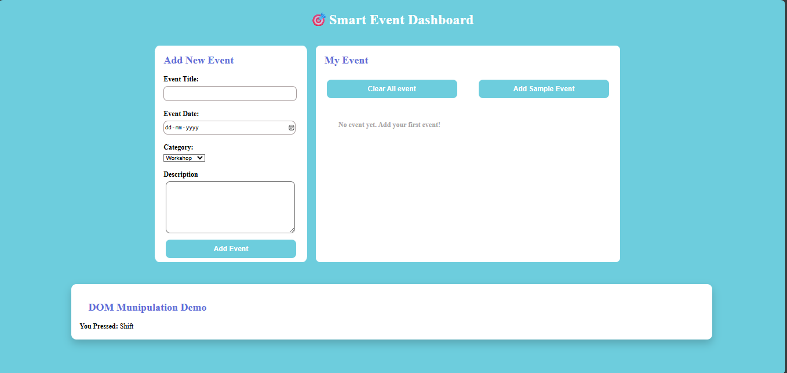

# 🎯 Smart Event Dashboard

A modern and interactive **Event Management Web Application** built using **HTML, CSS, and JavaScript**.
This project demonstrates DOM manipulation, event handling, and dynamic content rendering in a clean dashboard UI.

---

## Features

Add new events (Title, Date, Category, Description)
Display events dynamically
Clear all events instantly
Add sample demo events
Real-time keyboard key detection (DOM Demo section)
Clean card-based responsive layout

---

## Technologies Used

* HTML5
* CSS3 (Flexbox layout, modern UI styling)
* JavaScript (Vanilla JS)
* DOM Manipulation

---

## 📂 Project Structure

Smart-Event-Dashboard/
│
├── index.html
├── index.css
├── index.js
└── README.md

## 🧠 Concepts Covered

* DOM Selection (`getElementById`)
* Event Handling (`onclick`, `keydown`)
* Dynamic Element Creation (`createElement`)
* Template Literals
* Form Validation
* Conditional Rendering

## ▶️ How to Run the Project

1. Clone the repository:

git clone [https://github.com/vishalkumarjha192/smart-event-dashboard.git](https://github.com/vishalkumarjha192/web-dev/tree/main/Smart-Event-Dashboard)

2. Open the project folder.
3. Open `index.html` in your browser.

(Recommended: Use Live Server in VS Code for better development experience.)

## How It Works

### 1️⃣ Add Event

Users enter event details and click **Add Event**.
The event is dynamically added to the "My Event" section.

### 2️⃣ Clear All Events

Removes all events and restores the default message.

### 3️⃣ Add Sample Events

Automatically adds predefined sample events for demonstration.

### 4️⃣ DOM Manipulation Demo

Displays the key pressed on the keyboard in real time.

## 📈 Future Improvements

 Add delete button for each event
 Add edit functionality
 Store events using LocalStorage
 Add search & filter option
 Improve mobile responsiveness
 Add dark mode support

## 👩‍💻 Author

Vishal Kumar Jha
GitHub: [https://github.com/vishalkumarjha192](https://github.com/vishalkumarjha192)

---

## 📄 License

This project is open-source and free to use for educational purposes.

