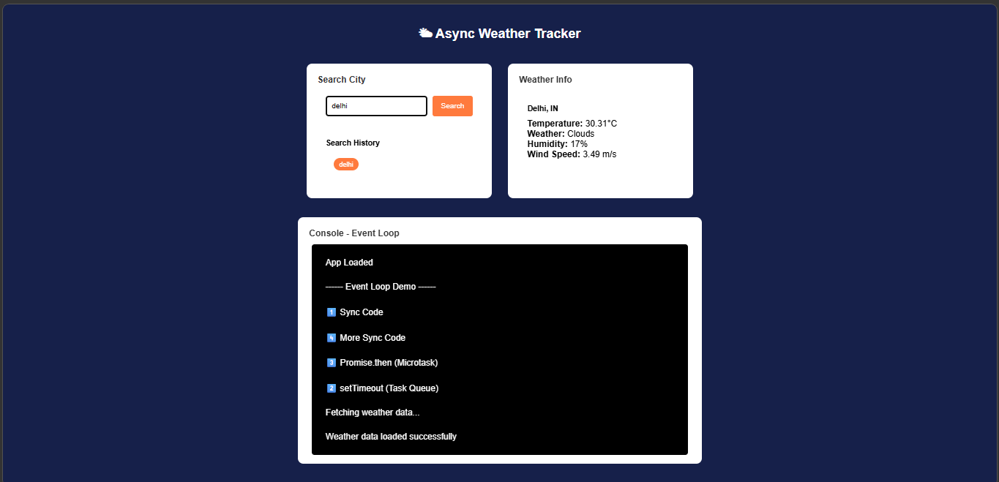
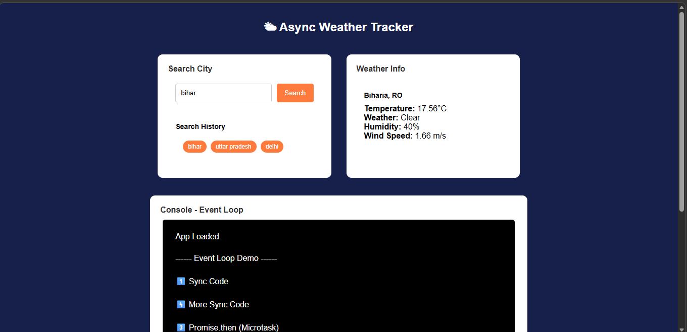

# 🌤 Async Weather Tracker

A simple weather application built using **HTML, CSS, and JavaScript**.
This project demonstrates **Async/Await, Fetch API, Local Storage, and
the JavaScript Event Loop** while displaying real-time weather
information.

------------------------------------------------------------------------
## 📷 Screenshots

)



------------------------------------------------------------------------

## ✨ Features

-   🔍 Search weather by city name
-   🌡️ Shows temperature, weather condition, humidity, and wind speed
-   📜 Saves last **5 searched cities** using Local Storage
-   ⚡ Uses **async/await** for API calls
-   🔄 Demonstrates **JavaScript Event Loop** in console section
-   📱 Simple and responsive UI

------------------------------------------------------------------------

## 🛠 Technologies Used

-   HTML5
-   CSS3
-   JavaScript (ES6)
-   OpenWeatherMap API
-   Local Storage

------------------------------------------------------------------------

## 📁 Project Structure

async-weather-tracker/ │ ├── index.html ├── style.css ├── script.js └──
README.md

------------------------------------------------------------------------

## 🚀 How to Run

1.  Download or clone the project.

2.  Add your API key in **script.js**:

``` javascript
const API_KEY = "YOUR_API_KEY";
```

3.  Open **index.html** in your browser.

Or run using a local server:

``` bash
python -m http.server
```

------------------------------------------------------------------------

## 🎯 How to Use

1.  Enter a **city name** in the search box.
2.  Click **Search** or press **Enter**.
3.  Weather details will appear on the screen.
4.  Previous searches appear as buttons.
5.  Click a button to search that city again.

------------------------------------------------------------------------

## 🧠 Concepts Used

### Async / Await

``` javascript
async function getWeather(){
  const response = await fetch(url);
  const data = await response.json();
}
```

### Local Storage

``` javascript
localStorage.setItem("history", JSON.stringify(history));
```

### Event Loop Example

Execution order shown in console:

1️⃣ Sync Code\
4️⃣ More Sync Code\
3️⃣ Promise.then (Microtask)\
2️⃣ setTimeout (Task Queue)

------------------------------------------------------------------------

## 🔑 API Used

https://api.openweathermap.org/data/2.5/weather?q={city}&appid={API_KEY}&units=metric

------------------------------------------------------------------------

## 👨‍💻 Author

**Vishal Kumar Jha**\
GitHub: https://github.com/vishalkumarjha192

